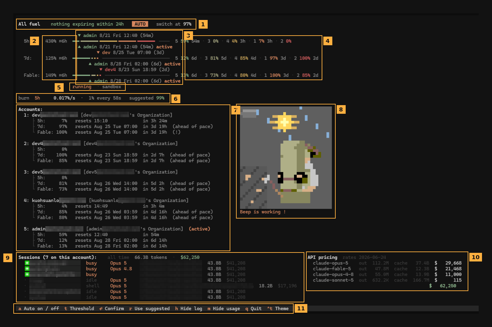

# cfuel

> 繁體中文版:[README.zh-TW.md](README.zh-TW.md)


**A fuel gauge for your Claude Code accounts.**

If you hold more than one Claude account, two things go wrong on their own. Quota
you paid for expires unused, because it sits on an account you were not working
on. And a long run dies mid-task, because the account you *were* on hit a limit
between two checks.

`cfuel` is one screen that answers both, and — if you let it — moves you off an
account before either happens.

<br clear="right">

---

## Install

Needs **Python ≥ 3.12**. `uv` fetches a suitable one, so nothing has to change
about your system Python.

```bash
curl -LsSf https://astral.sh/uv/install.sh | sh          # if you don't have uv
uv tool install "git+ssh://git@github.com/kuohsuanlo/claude-fuel.git"
```

That installs one command: **`cfuel`**. Bare `cfuel` opens the screen; anything
after it is the account CLI (`cfuel add`, `cfuel list`, …).

It claims no command name that upstream claude-swap uses, so the two can be
installed side by side and share the same accounts. Re-run the install with
`--force --reinstall` to update — `uv tool upgrade` does not re-fetch a git
source.

---

## Reading the screen



### ① The headline — what is about to be lost

`nothing expiring within 24h`, or the name of the quota that is: `dev5 7d 28%
expiring within 24h`.

When several are expiring it counts the rest (`+1 more`) rather than adding them
up. A percentage is a fraction of *one plan's one window*, and the pools differ,
so 28% of one plus 10% of another is not a number. Naming one and counting the
others is the most that can be said honestly.

`AUTO` means the engine is armed. `switch at 97%` is the threshold in force.

### ② How full the tank is, and how long it lasts

`430% ≈6h` — the whole fleet's remaining quota for that window, then how long it
lasts at the current burn.

**Over 100% is normal.** The unit is one account's window, so three untouched
accounts read 300%. Normalising that away would print the same "45%" for a fleet
of one and a fleet of six.

The runway is in **time**, because time is the only unit that needs no
conversion. Percentages are fractions of pools that differ per window and per
plan; tokens are a quantity nobody budgets in. "How long can I keep working" is
the question actually being asked.

It is computed as the time to burn each account's share in turn, at that
account's own rate — which works because **the work belongs to the machine, not
to the account**. Switching accounts does not change what is running.

### ③ The gauge, and the two markers

The coloured run is what is left; the dashed track is what is spent. Each
account's share is packed to the left, so the **length of the run is the fleet's
remaining fuel** and the caps inside it are the boundaries between accounts.

**Colour is an account's identity** — ranked once by how far its weekly reset is
from now, furthest green, soonest red, and reused on all three rows. The rows are
ordered on that same ranking, so the spectrum always runs green on the left to
red on the right, and a colour means the same thing everywhere.

Colour deliberately does *not* follow the waste risk the strategy ranks by. Risk
is headroom *divided by* that distance, so an account with 8 points left comes
out the calmest thing on screen precisely because it has nothing to lose —
"nearly exhausted" and "plenty of time" ended up the same green.

- **`▼` above** — the account whose quota in *that* window expires soonest. Hidden
  when there is nothing left to lose.
- **`▲` below** — the account being spent right now.

**The gap between those two markers is the point of the screen.** They answer
different questions — what dies first, and what am I spending — and when they
are far apart, something is being wasted.

Every absolute time carries its weekday (`8/25 Tue 07:00`). A bare date is a
lookup: is that tomorrow, the weekend, next week? That judgement is the whole
reason the number is there.

### ④ Per-account numbers

`5 59% 54m` — account number, how much of that window it has used, and when it
resets. Same order as the bar, same colours.

### ⑤ Whether a per-model limit is in force

`running · sandbox`, or `not running`.

An account reports a weekly window per model (`Fable`) on top of its 5h and 7d
ones. That window only matters while you are actually using the model — but the
decision covers the **whole machine**, so one unrelated session on Fable pins it
for everyone, and every account exhausted on Fable then reads as unusable.

This line names who is holding it. Without it you could see that a limit applied
but never who applied it.

A window that is not in force keeps its bar rather than disappearing: the quota
is real and still expires, it just is not what will stop you right now.

### ⑥ Burn rate, and the threshold it implies

`0.017%/s · 1% every 58s · suggested 99%`

The rate is measured locally, from Claude Code's own transcripts — every request
records its token counts, and reading them costs nothing. All sessions on the
machine are watched, not just the one you launched `cfuel` from.

Both forms are shown because a threshold is a decision about *how much warning
you get*, and seconds-per-percent states that directly.

`suggested` is the highest threshold the current rate can survive. Pressing `r`
adopts it — but **only ever downward**: on a quiet machine the suggestion is 99,
and adopting that would hand back the reserve of someone who had deliberately set
94.

### ⑦ The accounts

Every window of every account, with its reset and a countdown. `(!)` marks one at
its limit; `(ahead of pace)` marks one being spent faster than its window
replenishes.

### ⑧ Beep, and the sky

Beep is an instrument, not decoration. He **mines while tokens are being spent**,
and his swing rate follows the burn rate. He **sleeps when nothing has burned for
ninety seconds** — which tells you something no number can: whether a burn
reading of zero means idle or means broken.

Above him is the real sky: sun or moon placed by your local clock, with the
weather where you are. It **costs no tokens** — the sun is arithmetic on the
clock, and the weather is one small key-less request on a background thread, a
few times an hour, cached to disk. With no network it draws a clear sky rather
than presenting a default as a measurement.

### ⑨ Sessions

Every session on the machine, by the name you gave it, with the status Claude
Code itself reports and **the model it is running**.

They all spend the same active account, so arming the engine moves all of them at
once. The model column is what explains ⑤: one session on Fable is enough to pin
that window for the whole fleet.

Beside the count is what has gone through this machine all-time, and each row
carries its project's share. `m` hides the figures.

### ⑩ API pricing

The same spend broken down per model.

**Tokens are measured; dollars are derived from a dated table** — the date is on
screen because prices change, and a figure from a stale table is honest only
while it says which table it used.

**Cache reads set the total.** They are 63 of this machine's 66 billion tokens,
and price at a tenth of the input rate (writes at a quarter more). The headline
per-model rate explains almost none of the figure, which is why the cache column
sits next to the cost.

**It is not a bill.** On a subscription the invoice is flat. This is what the same
work would have cost pay-as-you-go.

### ⑪ Keys

| Key | Does |
| --- | --- |
| `a` | Auto-switching on / off (**on** at launch) |
| `↑` `↓` | Pick an account — only when auto is **off** |
| `enter` | Switch to the picked account |
| `t` then `←` `→` | Adjust the threshold — **written to settings.json** |
| `r` | Adopt the suggested threshold (downward only) |
| `h` | Hide the engine's log line |
| `m` | Hide the token and cost figures |
| `q` | Quit |

Arming and disarming never disturbs the display: the readings keep updating
either way, because you arm it *after* reading the screen, and a toggle that
reset what you were looking at would make that impossible.

---

## How it decides

### Spend what is about to expire

The default strategy, `waste-first`, ranks accounts by **weekly headroom divided
by hours until that window resets** — how fast quota is walking toward being
wasted.

Upstream's default ranks by how much is left, which reliably parks on the account
holding the *longest* deadline: the quota in the least danger. Measured on a real
fleet, 49 points expiring in 20 hours scored 2.4 %/h against the active account's
0.46 %/h, and the tool sat on the active account until those 49 points expired.

Ranking by deadline alone has the opposite flaw — it will move to an account that
resets sooner but has 2 points left to rescue.

```bash
cfuel config set autoswitch.strategy waste-first    # the default
cfuel config set autoswitch.strategy consume-first  # soonest reset, ignoring size
cfuel config set autoswitch.strategy best           # upstream: most left
```

### Spend the account that has already lost a model

An account whose Fable window is exhausted can only ever absorb non-Fable work.
One with Fable intact can absorb either. So an Opus turn on the second destroys
quota that only *it* could have served; the same turn on the first destroys none.

The engine therefore drains the less capable account first, and **a strictly less
capable candidate skips the risk gate entirely** — otherwise the rule could never
fire, because an account holding model-less quota is by construction the calmest
thing on the board and never qualified as a target.

This is a dominance argument, not a tuned preference: draining it first is never
worse, and is better the moment a task needs the model you kept. It lifts when
the model is actually running, and when the candidate's own quota expires within
a day — use-it-or-lose-it beats keeping a window intact for a task that may never
come.

### Switch before the wall, not at it

The usage endpoint allows roughly **28–30 requests per rolling hour**, so the
fastest honest sample of your utilization is one point every three minutes. A
heavy parallel turn crosses ten points in that time.

A threshold is a *position*, and a position set where the average looks safe is
passed long before the next sample lands. So the burn rate is measured from the
transcripts instead, and the effective trigger becomes the lower of your
threshold and the value the current rate can survive.

**The reserve is a full engine tick, plus a floor.** Every tick may fetch usage,
and that budget is why the loop cannot run every second — so the tick interval
*is* the exposure. Reserving ten seconds while ticking every sixty left five
sixths of the gap uncovered, and a live agent was cut off through it at 0.062
%/s: 3.7 points a minute against a 0.6-point reserve.

The floor applies to an idle reading too. Zero measured is a statement about the
last minute, not a promise about the next one, and the moment before a heavy turn
starts is exactly when the reserve matters.

```bash
cfuel config set autoswitch.burstGuard false     # off
cfuel config set autoswitch.burstFloorPct 2      # reserve more than the default 1
```

**The same reserve gates the destination.** Requiring only `headroom > 0` of an
account you are moving *to* is the identical error one step later: the engine
landed on an account with 3% of its five-hour window left while burning 0.75 %/s
— four seconds — and the task died on arrival, with roomier accounts passed over
because the ranking key says nothing about the short window.

### Count the model limits you are actually using

`autoswitch.model` defaults to **`all`**: the API only reports a per-model window
for a limit the account really has, and a limit that exists will stop the work
when it fills. Ignoring one was not cosmetic — an account showing `Fable 100%`
next to `7d 95%` was ranked the *most urgent account to keep burning*, because
the engine read the 7d headroom the model no longer had.

But **which of them gates is measured, not declared**. A model gates while it has
produced traffic in the last five minutes, or while it is the model you have
selected — Claude Code persists that choice, so switching with `/model` counts
before you have spent anything, which observation alone can never do.

An idle machine relaxes nothing: "running Opus, not Fable" and "running nothing"
look identical in the token stream and mean opposite things.

```bash
cfuel config set autoswitch.model none        # ignore per-model limits
cfuel config set autoswitch.model Fable,Opus  # only these
cfuel config set autoswitch.measuredModelMix false   # always gate on the list
```

### Compare like with like

The usage API reports only utilization, so 40% of a 20× plan and 40% of a 5× plan
are identical to it while being four times apart in real work. Bar widths are
weighted by plan size — configured, or measured from the calibration, or equal
before either is known.

The same lesson applies to the burn scale: tokens are a cost-shaped proxy, not the
provider's accounting, so the constant relating them to window percent is
calibrated against the samples that do arrive — **per account and per window**.
Both halves were bugs found by measuring. Pairing tokens with the *binding* window
gave 411k, 2,148k and 348k tokens per percent from three consecutive samples of
one account, because the binding window flips between 5h and 7d as the short one
resets: two rulers averaged together, understating the rate threefold.

```bash
cfuel config set autoswitch.accountWeights "1=20,2=5,3=5"
```

---

## Commands

Everything upstream can do, under one name. `cfuel help` prints the full list.

| Command | Does |
| --- | --- |
| `cfuel` | Open the screen |
| `cfuel add` | Add the currently logged-in account |
| `cfuel list` / `ls` | List accounts and their usage |
| `cfuel status` | Show the current account |
| `cfuel switch [num\|email]` | Rotate, or jump to one account |
| `cfuel remove` / `disable` / `enable` | Manage the rotation |
| `cfuel run <num\|email> [-- ...]` | Run as an account, this terminal only |
| `cfuel map` / `alias` / `swap` / `move` | Directory mappings, names, slot order |
| `cfuel auto` | Headless auto-switch loop |
| `cfuel config [set KEY VALUE]` | Show or change settings.json |
| `cfuel export` / `import <path>` | Move accounts between machines |
| `cfuel upgrade` | Self-upgrade |

---

## Configuration

`settings.json` lives beside your accounts (`~/.local/share/claude-swap/` on
Linux). `cfuel config` lists everything; the keys this fork adds:

| Key | Default | Meaning |
| --- | --- | --- |
| `autoswitch.strategy` | `waste-first` | `waste-first`, `consume-first`, `best` |
| `autoswitch.burstGuard` | `true` | Let the measured rate trigger early |
| `autoswitch.burstFloorPct` | `1` | Points always reserved, on top of the rate |
| `autoswitch.model` | `all` | Per-model limits that gate a switch; `none` to ignore |
| `autoswitch.measuredModelMix` | `true` | Gate on a model only while it is running |
| `autoswitch.accountWeights` | — | Relative plan sizes, `1=20,2=5` |

**Only values that differ from their default are stored.** Writing every field
froze the whole section the first time you nudged any single one of them, so
later improvements to a default could never reach a machine already running.

**Switching moves every session on the machine.** They all share the active
login.

---

## Development

```bash
git clone git@github.com:kuohsuanlo/claude-fuel.git
cd claude-fuel
uv sync
uv run pytest -q                       # 2356 tests
uv tool install --force --reinstall .  # install your working tree
```

`art/beep/` keeps the sprite extraction: `PIXELS.txt` is Beep dumped one pixel at
a time with his palette and every limb marked, and `inspect.png` is the same
magnified with coordinates.

---

## Upstream, and thanks

**cfuel is a fork of [realiti4/claude-swap](https://github.com/realiti4/claude-swap)**
(the `cswap` command). Managing accounts — adding them, storing credentials,
rotating, session and menu-bar modes, the dashboard — is upstream's work and
still works as documented there. This fork adds the parts that answer *when* and
*why*.

The on-disk layout is unchanged, so this can be installed over an existing
claude-swap without touching your accounts, and you can go back. Upstream is
tracked as the `upstream` remote:

```bash
git fetch upstream && git merge upstream/main
```

MIT, as upstream. See [LICENSE](LICENSE) — copyright Onur Cetinkol, with fork
changes under the same terms.
