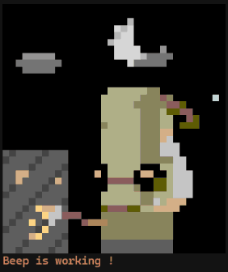
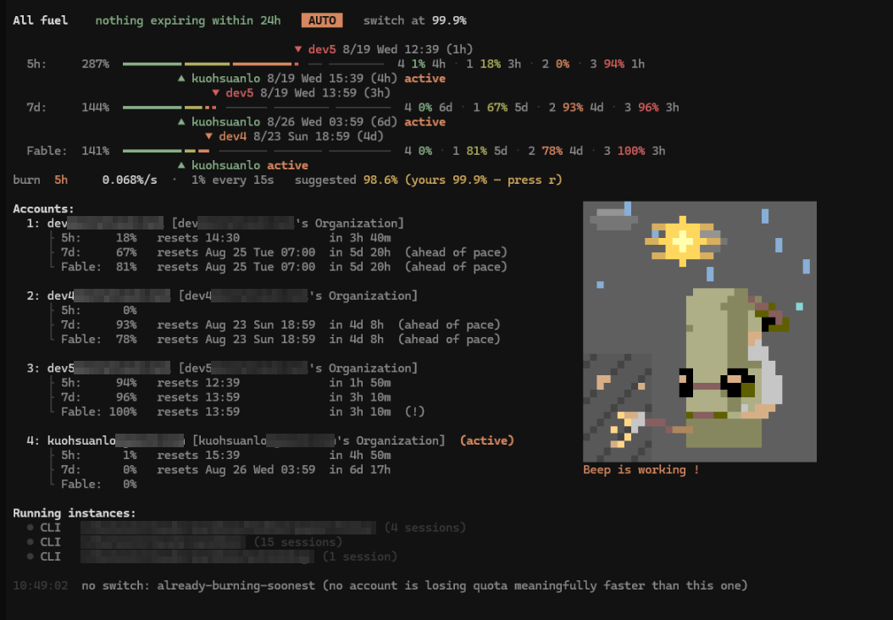

# cfuel



**A fuel gauge for your Claude Code accounts.**

One command opens one screen that answers two questions: *what quota am I
about to waste*, and *am I about to hit a wall* — and, if you let it, moves you
off an account before either happens.

Beep mines while your tokens burn, faster when you burn faster, and sleeps when
nothing has run for ninety seconds. That last part tells you something no number
on the screen can: whether a burn reading of zero means idle or means broken.

<br clear="right">



---

## Install

Needs **Python ≥ 3.12**. `uv` fetches a suitable one, so nothing has to change
about your system Python.

```bash
curl -LsSf https://astral.sh/uv/install.sh | sh          # if you don't have uv
uv tool install "git+ssh://git@github.com/kuohsuanlo/claude-fuel.git"
```

That installs exactly one command: **`cfuel`**.

> The repository is private, so HTTPS installs fail — SSH is required and the
> machine needs a key with access. To update, re-run the same command with
> `--force --reinstall`; `uv tool upgrade` does not re-fetch a git source.

### Installs alongside `cswap`

`cfuel` deliberately claims **no** command name that upstream claude-swap uses,
so the two can be installed at the same time and neither shadows the other:

```bash
uv tool install claude-swap                              # upstream: cswap
uv tool install "git+ssh://git@github.com/kuohsuanlo/claude-fuel.git"   # this: cfuel
```

They **share the same accounts, credentials and `settings.json`** — the on-disk
layout is untouched from upstream, so switching with one is visible to the
other immediately, and a threshold set in `cfuel` is the one `cswap auto`
reads. Which of the two you type is a matter of what is on your PATH, never of
which data you get.

---

## `cfuel`

```
cfuel
```

Bare `cfuel` opens the fleet view. Anything after it is the account CLI —
see [Commands](#commands).

| Key | Does |
| --- | --- |
| `a` | Auto-switching on / off (**on** at launch) |
| `↑` `↓` | Pick an account — only when auto is **off** |
| `enter` | Switch to the picked account |
| `t` then `←` `→` | Adjust the threshold — **written to settings.json** |
| `r` | Adopt the suggested threshold |
| `h` | Hide the engine's log line |
| `q` | Quit |

Arming and disarming never disturbs the display: the readings keep updating
every second either way, because you arm it *after* reading the screen, and a
toggle that reset what you were looking at would make that impossible.

### The three gauges

```
All fuel    47 pts expire within 24h    AUTO    switch at 99.7%
                           ▼ dev5 8/19 Wed 13:59 (4h)
  5h:     208%  ━━━━━━━━━━━╸━━━━━━━━━━━╸╸ ───────────  1 0% · 2 0% · 3 92% 3h
  7d:      47%  ━━━╸╸╸ ──────── ─────────── ──────────  1 64% 5d · 2 93% 4d · 3 96% 4h
  Fable:   45%  ━━╸━━╸ ───────── ───────── ───────────  1 77% 5d · 2 78% 4d · 3 100% 4h
                           ▲ dev5 8/19 Wed 13:59 (4h) active
```

One bar per window — session (5h), weekly (7d), and your per-model weekly
limit. Each is the **whole fleet's remaining quota for that window**, with
every account's share packed to the left, so the length of the coloured run is
how much fuel is left and the boundaries inside it are who holds it.

- **The number in front is what is in the tank**, in units of one account's
  window — so three untouched accounts read **300%**, not 100%. Over 100% is
  the normal case, not an error: normalising it away would say the same thing
  about a fleet of one and a fleet of six. It is weighted by plan size using
  the same weights the bar is drawn with, so the figure and the length of the
  coloured run can never state different amounts.
- **Colour is an account's identity**, ranked once by **how far its weekly
  reset is from now** — furthest is green, soonest is red — and reused on all
  three bars. The bars are ordered on that same ranking (it is literally the
  reversed list, not a second sort), so the spectrum always runs green on the
  left to red on the right and a colour means the same thing on every row.
- Colour deliberately does **not** follow the waste risk the strategy ranks by.
  Risk is headroom *divided by* that distance, so an account with 8 points left
  comes out the calmest thing on screen precisely because it has nothing to
  lose — "nearly exhausted" and "plenty of time" painted the same green.
- **`▼` above** names the account whose quota in *that* window expires soonest;
  it is hidden when there is nothing left to lose.
- **`▲` below** names the account being spent right now.
- The gap between those two markers is the entire point of the screen.
- **Every absolute time carries its weekday** (`8/25 Tue 06:59`). A bare date
  is a lookup — is that tomorrow, the weekend, next week? — and that judgement
  is the whole reason the number is on screen.

### The burn readout

```
burn  5h     0.023%/s  ·  1% every 43s
      7d     0.010%/s  ·  1% every 103s
      Fable  0.011%/s  ·  1% every 90s   suggested 99.5% (yours 99.9% — press r)
      dev's 23 pts are all spendable before they expire
      dev4 takes over by Sun 07:15 · its 7 pts need 40m and have 11.6h
```

One rate per window, because there is no such thing as "the" burn rate — the
same tokens are a large fraction of a five-hour window and a small fraction of
a weekly one. Both forms are shown, `%/s` and seconds-per-percent, because a
threshold is a decision about *how much warning you get* and the second form
states that directly. `r` adopts the suggested threshold, which is the highest
one the current rate can survive.

**The last line says when the other account gets its turn.** "Nothing is more
urgent than this one" is a true answer to a question nobody asked; the one
people actually ask is *then when does account 2 get used*. It is answerable
because the risk axis carries the deadline in its denominator: a candidate that
loses today's comparison climbs on its own until it clears the hysteresis gate.
The line pairs that instant with whether the quota survives the wait — 7 points
needing 40 minutes with 11.6 hours of window left costs nothing, and the same
line turns amber when it is not. It says "by" rather than "at" on purpose: the
estimate holds both accounts' headroom still, and spending the active one only
brings the handover forward.

### The sky

Sun or moon placed by your local clock along an arc, with the weather that is
actually outside. It **costs no tokens** — nothing here goes near a model. The
sun is arithmetic on the clock; the weather is one small key-less JSON request
on a background thread, a few times an hour, cached to disk. It never blocks a
repaint and never raises; with no network it draws a clear sky rather than
presenting a default as a measurement. Sky and pet share one background, so it
is a scene Beep stands in rather than a cut-out pasted under a weather widget.


*Left to right: mining under a clear noon, asleep under a crescent moon, and
mining in the rain — the same pet, three real readings.*

Beep is real pixel art, extracted pixel by pixel from reference art of Kenshi's
Beep and then rigged. The rules that took the most work are the ones that stop
him looking wrong: fixed-height bones (head, face, chest, legs) never squash,
because a body that changes height between frames reads as a glitch rather than
as motion; the frame rate is constant, since animation that varies its own
timing looks like lag; he faces the rock he is hitting; and the pick swings
from his arm.

---

## Commands

Everything upstream can do, under one name. `cfuel help` prints the full list.

| Command | Does |
| --- | --- |
| `cfuel` | Open the fleet view |
| `cfuel add` | Add the currently logged-in account |
| `cfuel add-token [TOKEN]` | Register a setup-token or API key |
| `cfuel list` / `ls` | List managed accounts and their usage |
| `cfuel status` | Show the current account |
| `cfuel switch` | Rotate to the next account |
| `cfuel switch <num\|email>` | Switch to a specific account |
| `cfuel remove <num\|email>` / `rm` | Remove an account |
| `cfuel disable` / `enable <num\|email>` | Hold an account out of auto-rotation, or return it |
| `cfuel run <num\|email> [-- ...]` | Run as an account, this terminal only |
| `cfuel map <num\|email> [path]` | Map a directory to an account |
| `cfuel alias <num\|email> <name>` | Give an account a short name |
| `cfuel swap <a> <b>` / `move <a> <slot>` | Rearrange slot numbers |
| `cfuel auto` | Headless auto-switch loop |
| `cfuel config [set KEY VALUE]` | Show or change settings.json |
| `cfuel export` / `import <path>` | Move accounts between machines |
| `cfuel tui` / `watch` | The original dashboard |
| `cfuel menubar` | macOS menu bar app |
| `cfuel upgrade` | Self-upgrade |

---

## What this fork changed

### `waste-first`, the new default strategy

Ranks accounts by **quota about to expire**: weekly headroom divided by hours
until that window resets. Upstream's default, `best`, ranks by how much is
left — which reliably parks on the account holding the *longest* deadline, the
quota in the least danger of being wasted.

Measured on a real fleet: 49 points expiring in 20 hours scored 2.4 %/h against
the active account's 0.46 %/h. `best` sat on the active account until those 49
points expired. `consume-first` ranks on the deadline alone, so it will happily
move to an account that resets sooner but has 2 points left to rescue.

The deadline axis applies only *below* the threshold. Above it a switch is an
escape, where the question is whether a landing is worth the move, so the
hysteresis margin still gates it and the deadline only orders the candidates
that clear it.

```bash
cfuel config set autoswitch.strategy waste-first    # the default
cfuel config set autoswitch.strategy consume-first  # soonest reset, ignoring size
cfuel config set autoswitch.strategy best           # upstream: most left, no deadlines
```

### Burst guard — what makes a 99% threshold usable

The usage endpoint allows roughly **28–30 requests per rolling hour**, so the
fastest honest sample of your utilization is one point every three minutes. A
heavy parallel turn crosses ten points in that time. A threshold is a
*position*, and a position set where the average looks safe is passed long
before the next sample lands.

So the burn rate is measured locally instead, from Claude Code's own transcripts
(`~/.claude/projects/**/*.jsonl`), which carry each request's token counts and
cost nothing to read. Every session on the machine is watched, not just the one
you launched `cfuel` from. The effective trigger becomes the lower of your
threshold and the value the current rate can survive — by default a burst of 2×
for 10 seconds. **It can only ever switch earlier than you asked.**

```bash
cfuel config set autoswitch.burstGuard false   # off
```

### Tokens are not percent, so the scale is measured

Weighted tokens are a cost-shaped proxy, not the provider's accounting, so the
constant relating them to window percent is never assumed — it is calibrated
against the API samples that do arrive, cached across restarts, and kept **per
account and per window**.

Both halves of that were bugs found by measuring:

- **Per window.** Calibration originally paired tokens with the *binding*
  window, and the binding window flips between 5h and 7d as the short one
  resets. Three consecutive samples of one account gave 411k, 2,148k and 348k
  tokens per percent — two different rulers averaged together, understating the
  rate roughly threefold, which is the direction that overshoots a threshold.
- **Per account.** Percent is a fraction of a *plan's* window, so pooling a 20×
  and a 5× account scales both by the fleet average.

An account switch drops the baselines, because an interval spanning a switch
charges one account's percentage with another's tokens — and an *unknown*
active account is not a switch, which is a distinction that cost a round of
silently wiped baselines to find. Note that the API reports **integer
percentages**: one percent of a weekly window is over a million weighted
tokens, so the weekly scale only calibrates after real accumulated use and
reads `API average` until it does.

### Per-model weekly limits count by default

An account reports a scoped weekly window per model (`Fable`, `Opus`) on top of
its 5h and 7d ones. Upstream gates on those only when `autoswitch.model` names
them, and the setting is unset by default — so the engine read the 5h/7d
headroom of an account whose model quota was already gone.

That is not a cosmetic gap. Caught live:

```
3: dev5   5h 90%   7d 95%   Fable 100% (!)      ← active
09:25:53  no switch: already-burning-soonest
          (no account is losing quota meaningfully faster than this one)
```

The engine ranked `dev5` the most urgent account to keep burning — on its 7d
window, at 95%, with 4h34m left, scoring 1.09 %/h. Fable was at **100%**: no
work needing that model could run there at all. Counting the scoped window
makes the same account read headroom 0, risk 0.00 %/h, and the fleet moves.

`autoswitch.model` therefore defaults to **`all`** — every scoped window the
account reports. The API only reports one for a limit the account actually
has, and a limit that exists will stop the work when it fills.

```bash
cfuel config set autoswitch.model none        # ignore per-model limits
cfuel config set autoswitch.model Fable,Opus  # only these
```

`none` is a word rather than a blank because the load-time clamp turns any
empty or non-string value back into the default.

The same list now feeds the screen. The model gauge used to be built from a
hardcoded `all` while the ranking read the setting, which is how a Fable bar
at 100% came to sit above an engine that could not see it — the one thing a
fuel gauge must never do.

### Plan sizes

The usage API reports only utilization, so 40% of a 20× plan and 40% of a 5×
plan are identical to it while being four times apart in real work. Unweighted,
one cell of a bar meant different amounts of work on the same row.

```bash
cfuel config set autoswitch.accountWeights "1=20,2=5,3=5"
```

Unset accounts fall back to their measured tokens-per-percent, and to equal
weight before that is known.

### Smaller corrections worth knowing about

- **"Stranded quota" is named as such.** "Nothing is more urgent" and "the
  urgent one is unreachable" are opposite situations that both end in holding,
  and the log used to report them identically. Found live: *account 3 is losing
  quota faster but has no room to work in; frees up in 1h 13m*.
- **The waste projection is in weekly units.** It used to multiply the
  *binding* window's rate by the hours until a *weekly* reset, and report "all
  spendable" about quota that was certainly going to be lost.
- **An account with no reported reset can never be "the expiring one."**
  `expires —` is not a deadline, and it used to win the `▼` marker.
- **`tokens_since` is half-open**, so a sample's boundary tokens are counted
  once rather than into both intervals.
- **The suggested threshold is rounded to one decimal.** It was printed to full
  float precision — `99.86597411%` — which reads as a measurement rather than
  as a setting you are about to type in.

---

## Configuration

`settings.json` lives beside your accounts (`~/.local/share/claude-swap/` on
Linux). `cfuel config` lists everything; the keys this fork adds:

| Key | Default | Meaning |
| --- | --- | --- |
| `autoswitch.strategy` | `waste-first` | `waste-first`, `consume-first`, `best` |
| `autoswitch.burstGuard` | `true` | Let the measured rate trigger early |
| `autoswitch.accountWeights` | — | Relative plan sizes, `1=20,2=5` |
| `autoswitch.model` | `all` | Per-model weekly limits that gate a switch; `none` to ignore |

The threshold you set with `t` in the TUI is written here too, so it survives a
restart.

**Switching moves every session on the machine.** They all share the active
login, so arming auto-switch moves all of them at once.

---

## Development

```bash
git clone git@github.com:kuohsuanlo/claude-fuel.git
cd claude-fuel
uv sync
uv run pytest -q                       # 2284 tests
uv tool install --force --reinstall .  # install your working tree
```

`art/beep/` keeps the sprite extraction: `PIXELS.txt` is Beep dumped one pixel
at a time with his palette and every limb marked, and `inspect.png` is the same
magnified with coordinates.

---

## Upstream, and thanks

**cfuel is a fork of [realiti4/claude-swap](https://github.com/realiti4/claude-swap)**
(the `cswap` command). Everything about managing accounts — adding them,
storing credentials, rotating, the session and menu-bar modes, the dashboard —
is upstream's work and still works exactly as documented there. This fork adds
the parts that answer *when* and *why*: a deadline-aware strategy, a burn rate
measured from your own transcripts, and a screen built around both.

The on-disk layout is unchanged from upstream, so this can be installed over an
existing claude-swap without touching your accounts, and you can go back.
Upstream is tracked as the `upstream` remote:

```bash
git fetch upstream && git merge upstream/main
```

MIT, as upstream. See [LICENSE](LICENSE) — copyright Onur Cetinkol, with fork
changes under the same terms.
